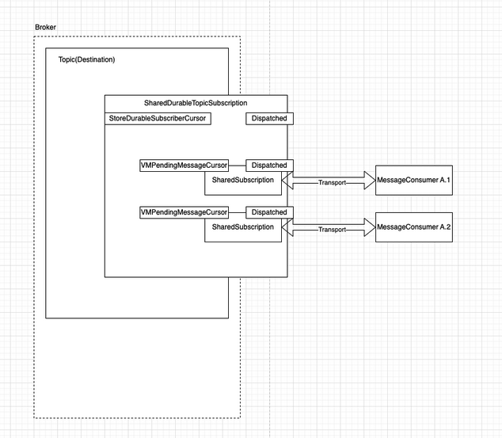
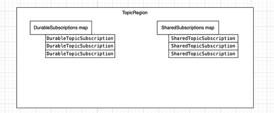
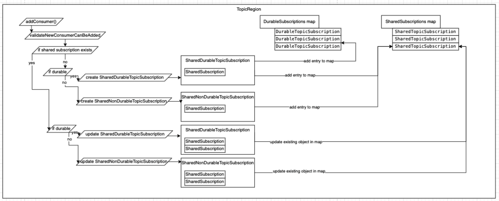
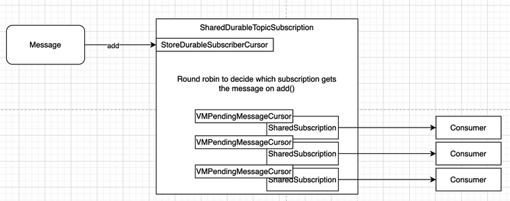
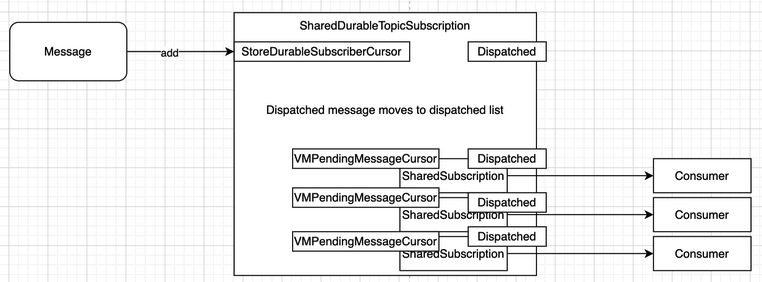
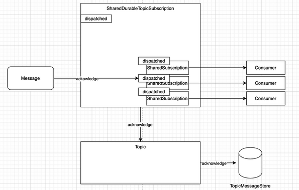
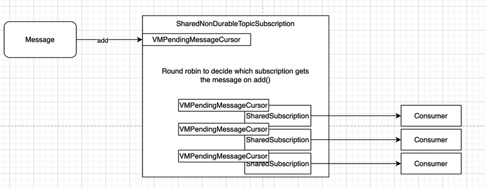
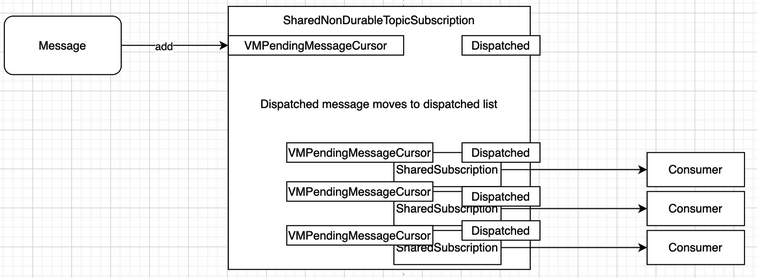
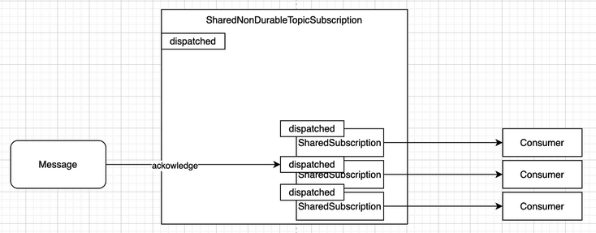
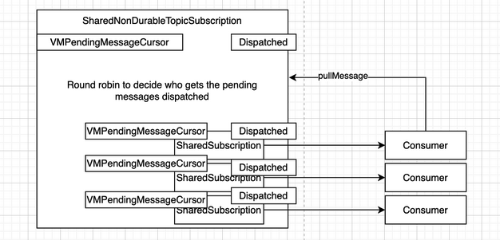

# JMS 2.0 / Jakarta Messaging 3.1: Shared Subscriptions

## Problem statement

JMS 2.0 / Jakarta Messaging 3.1 introduced a new set of  API for creating shared topic subscriptions that is not yet supported by ActiveMQ Classic. Even though the functionality can be achieved using virtual topics in ActiveMQ Classic, to be Jakarta Messaging 3.1 compliant, we will need to support that API. This document proposes several designs and evaluates their tradeoffs.

## Background

A JMS durable subscriber MessageConsumer is created with a unique JMS clientID and durable subscriber name. In JMS 1.1 only one JMS connection can be active at any point in time for one JMS clientID, and only one consumer can be active for a clientID and subscriber name. i.e., only one thread can be actively consuming from a given logical topic subscriber. This limits load balancing of messages or fast failover of the subscriber if that one process running that one consumer thread dies.

Virtual topics were introduced to mitigate these issues. The idea behind virtual topics is that producers send to a topic in the usual JMS way. Consumers can continue to use the Topic semantics in the JMS specification. However if the topic is virtual, consumers can consume from a physical queue for a logical topic subscription, allowing many consumers to be running on many machines & threads to balance the load.

JMS 2.0 and Jakarta 3.1 support shared subscriptions which enable durable and non-durable topic subscriptions that can be shared between any number of consumers. This allows consumers to share the work of consuming messages from a Topic which improves performance and reliability. This is a simpler solution than Virtual Topics as consumers can directly subscribe to the topic and not to underlying queues

## High level design approach

### Option 1: Reuse as much of the virtual topics implementation as possible.

This approach will implement shared subscription as a wrapper of virtual topics.

For shared subscriptions, extra logic would be needed to manage the consumer subscription to the queue as the queue internals should not be exposed to the users. An underlying queue could be created for each shared subscription on invocation of *`createSharedDurableConnectionConsumer`*. A mapping would be needed to identify which shared subscription maps to an underlying queue on the virtual topic(perhaps in *`QueueRegion`*). For example when the *`addConsumer`* method of *`AbstractRegion`* is invoked, a new queue would need to be created and the mapping from the subscription key to this queue created. When new shared subscriptions for the consumer are created then the mapping would ensure the subscription is created on the underlying queue for that subscription key.  
A *`VirtualTopicInterceptor`* overrides *`send`* to ensure messages get delivered to all destinations matching a wildcard. For shared subscriptions an interceptor could be created which sends messages to only one destination in a group of destinations matching a wildcard. This could be achieved in a round robin fashion.

**Pros:**

- Reuses logic from existing virtual topics and stays in line with existing solutions.

**Cons:**

- This may not be solving the problem at the right level. Shared subscriptions are applied at a subscription level, not a destination level.
- Extra logic is needed to correlate a shared subscription to a queue.
- The underlying queues would show in the ActiveMQ admin console. This may be confusing for users. It may also require protection to ensure these queues are not deleted or purged.

### Option 2 **\[Recommended\]**: Handling shared subscription logic separately

There already exists logic for effectively managing subscriptions in the *`DurableTopicSubscription`* and *`TopicSubscription`* classes. The main difference between what exists here and what is needed for shared subscriptions is the ability for the class to act as a composite subscription. The *`DurableTopicSubscription`* and *`TopicSubscription`* classes have already been optimized to use cursors to effectively page in messages for delivery. Messages could be dispatched from the *`SharedDurableTopicSubscription`* cursor to one of the cursors of the underlying subscriptions via round robin. A map from subscription key to shared subscription would be needed in the *`TopicRegion.`* This is for mappings and also to perform validation checks on the shared subscriptions. This could be managed in a similar way to the existing *`ConcurrentMap<SubscriptionKey, DurableTopicSubscription> durableSubscriptions`* map.



**Pros:**

- Cursors reduce the impact on RAM for in transit messages.
- Messages can be passed from producer to consumers directly if they are fast.

**Cons:**

- Implements a similar offering as virtual topics in a very different way. 

## Detailed Design

Option 2 is recommended and in this section we will focus on implementation design detail of option 2, handling shared subscription logic separately. The detailed design is divided into 7 categories.

### 1\. Shared durable subscription creation

When *`addConsumer`* is called on *`TopicRegion`* it uses the *`ConsumerInfo`* to determine if the subscription is durable. *`ConsumerInfo`* will need to be updated to include a new boolean *`shared`* property for determining if a consumer is also shared. *`TopicRegion`* maintains a *`ConcurrentMap<SubscriptionKey, DurableTopicSubscription>`* called *`DurableSubscriptions`* which it checks for existing subscriptions and throws a *`JMSException`* if the subscription key is already in use. It will also have a *`ConcurrentMap<SubscriptionKey, SharedTopicSubscription>`* called *`SharedSubscriptions`* which will be used to identify if a subscription is a shared subscription. This map can be updated when *`addConsumer`* invokes *`createSubscription`* on the *`TopicRegion`*. *`createSubscription`* will need to be updated with logic to create a new *`SharedDurableTopicSubscription`* or *`SharedNonDurableTopicSubscription`* . A new interface *`SharedTopicSubscription`* will extend the *`Subscription`* interface. It will be used to define methods for managing the shared consumers on a *`SharedSubscription`*. For example

```java
public interface SharedTopicSubscription extends Subscription {
    public Set<Subscription> getSharedConsumers();
    public void addSharedConsumer(Subscription subscription);
    public void removeSharedConsumer(Subscription subscription);
}
```
*`SharedDurableTopicSubscription`* and *`SharedNonDurableTopicSubscription`* will both implement the *`SharedTopicSubscription`* interface.



The *`DurableSubscriptions`* map on *`TopicRegion`* can be used to track if a shared subscription is also durable. *`addConsumer`* will also invoke its superclass *`AbstractRegion`* and will need to put the new *`SharedTopicSubscription`* to the *`Map<ConsumerId, Subscription>`* map called *`subscriptions`*. This method will also call *`addSubscription`* on all relevant Topics to add the new *`SharedTopicSubscription`*.  
The *`addConsumer`* method of *`TopicRegion`* can have additional checks for shared subscriptions. If an attempt is made to create a consumer which matches a subscription key in the *`SharedSubscriptions`* map then the request will be validated to ensure the same topic and message selector is used. Since shared subscriptions will also be added to the *`DurableSubscriptions`* map if durable, this map can be used to validate that a shared durable subscription and an unshared durable subscription may not have the same name and client identifier.



Link stealing allows a new client connection with the same client ID as an existing client to steal the connection. The existing client’s session will be closed and its network connection will be terminated. Link stealing will not be supported initially for shared consumers.

The *`addSubscriptionsForDestination`* method of *`TopicRegion`* restores all durable subscriptions on a Topic when a connection is first added to that destination. A *`SharedDurableTopicSubscription`* should be restored as a *`DurableTopicSubscription`* by default. The *`addSubscriptionsForDestination`* method has logic to determine this based on the restored *`SubscriptionInfo`*. If a shared durable consumer is added using the same subscription key, then the *`DurableTopicSubscription`* can become a *`SharedDurableTopicSubscription`* as long as no active consumers exist.

Cursors can be overridden in the activemq.xml configuration. If a user overrides the cursor for a *`SharedTopicSubscription`* then the subscription should still behave as expected as all cursors implement the *`PendingMessageCursor`* interface. For example if *`<pendingSubscriberPolicy> <fileCursor/> </pendingSubscriberPolicy>`* is used then the *`SharedTopicSubscription`*  should use a *`fileCursor`* instead of a *`vmCursor`*.

It may be possible for a rogue client to create an excessive number of concurrent consumers on a shared subscription. Hence it’s reasonable to expose a property that users can set which limits the number of consumers on a shared subscription. The default for this property could be \-1 denoting no limit.


### 2\. Message delivery to shared durable subscriptions

A new class *`SharedDurableTopicSubscription`* is created which extends *`DurableTopicSubscription`* . This class can reuse a lot of the logic from a *`DurableTopicSubscription`* for persistent dispatch of messages. It holds a set of *`SharedSubscription`* which are responsible for distributing messages to the shared consumers.  
*`SharedSubscription`* is a new class which extends *`PrefetchSubscription`* and implements abstract methods like *`acknowledge`*.  
The *`SharedDurableTopicSubscription`* has a *`PendingMessageCursor`* which is a  
*`StoreDurableSubscriberCursor`* containing messages for dispatch. Each of the *`SharedSubscriptions`* have their own *`VMPendingMessageCursor`* which contains messages to be dispatched to each consumer. The *`add`* method of *`SharedDurableTopicSubscription`* will add a message to its *`StoreDurableSubscriberCursor`* . It will then do a round robin to decide which subscription gets the message added to their *`VMPendingMessageCursor`*.



The *`SharedSubscription`* will then invoke *`DispatchPending`* to dispatch messages to the relevant consumer via the appropriate transport connection. When messages are dispatched they are removed from the *`pending` `MessageCursor`* and added to a list of *`MessageReference`* called *`dispatched`*. The *`SharedDurableTopicSubscription`* will also move the dispatched message from it’s *`pending` `MessageCursor`* to it’s *`dispatched`* list. The *`dispatched`* list reflects messages that are dispatched to consumers and awaiting acknowledgement. Should a consumer fail to process the dispatched message, the message can move from *`dispatched`* back onto the *`pending` `MessageCursor`*.



When *`acknowledge`* is invoked on the *`AbstractRegion`*(which *`TopicRegion`* extends) it gets the relevant subscription from the *`ConsumerBrokerExchange`*. In this case it would be a *`SharedSubscription`* to which the message was sent. The *`acknowledge(final ConnectionContext context,final MessageAck ack)`* method from *`PrefetchSubscription`*(which *`SharedSubscription`* extends) is called to remove the appropriate messages from the *`dispatched`* list. It would then invoke the overridden *`acknowledge`* method on *`SharedSubscription`* which could be used to call back to the *`acknowledge`* method on it’s parent *`SharedDurableTopicSubscription`* .



When a consumer invokes *`pullMessage`* on a *`SharedSubscription`* then the *`prefetchExtension`* of the subscription is set to the pull quantity. *`dispatchPending`* is then triggered on the parent *`SharedDurableTopicSubscription`* doing a round robin on subscriptions that have space in their prefetch. This means that *`SharedSubscription`s* on other consumers may also receive the messages in pending. This is to maintain balanced message distribution across consumers.

### 3\. Message delivery to shared non-durable subscriptions

A new class *`SharedNonDurableTopicSubscription`* is created which extends *`TopicSubscription`* . This class can reuse a lot of the logic from a *`TopicSubscription`* for dispatch of messages in memory. Similar to *`SharedDurableTopicSubscription`*`,` it holds a set of *`SharedSubscription`* which are responsible for distributing messages to the shared consumers.  
The *`SharedNonDurableTopicSubscription`* has a *`PendingMessageCursor`* which is a  
*`VMPendingMessageCursor`* containing messages for dispatch. Each of the *`SharedSubscriptions`* have their own *`VMPendingMessageCursor`* which contains messages to be dispatched to each consumer. The *`add`* method of *`SharedDurableTopicSubscription`* will add a message to its *`VMPendingMessageCursor`* . It will then do a round robin to decide which subscription gets the message added to their *`VMPendingMessageCursor`*.



The *`SharedSubscription`* will then invoke *`DispatchPending`* to dispatch messages to the relevant consumer via the appropriate transport connection. When messages are dispatched they are removed from the *`pending`* *`MessageCursor`* and added to a list of *`MessageReference`* called *`dispatched`*. The *`SharedNonDurableTopicSubscription`* will also move the dispatched message from its *`matched`* *`MessageCursor`* to its *`dispatched` `DispatchNode`* list.



Similar to *`SharedDurableTopicSubscription`* the *`acknowledge(final ConnectionContext context,final MessageAck ack)`* method from *`PrefetchSubscription`*(which *`SharedSubscription`* extends) is called to remove the appropriate messages from the *`dispatched`* list. It would then invoke the overridden *`acknowledge`* method on *`SharedSubscription`* which could be used to call back to the *`acknowledge`* method on its parent *`SharedNonDurableTopicSubscription`* .



When a consumer invokes *`pullMessage`* on a *`SharedSubscription`* then the *`prefetchExtension`* of the subscription is set to the pull quantity. *`dispatchMatched`* is then triggered on the parent *`SharedNonDurableTopicSubscription`* doing a round robin on subscriptions that have space in their prefetch. This means that *`SharedSubscription`s* on other consumers may also receive the messages in pending. This is to maintain balanced message distribution across consumers.

